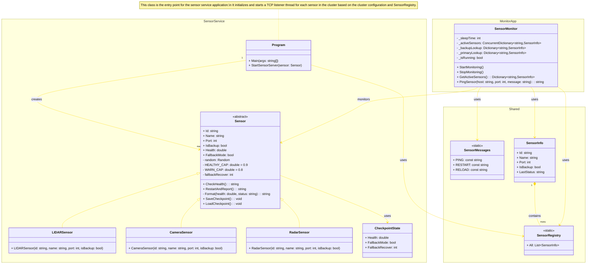

# SWEN 755 - Fault Recovery Tactic Implementation
This project implements the Fault Recovery with Redundancy tactic for critical components in an autonomous system, including LIDAR, camera, and radar sensors. It builds on the Heartbeat tactic by adding failover and recovery using passive redundancy.

Each sensor (primary or backup) runs in its own process (thread), and all components communicate over TCP across separate Docker containers. A central monitor continuously pings the sensors. If a primary sensor fails or becomes unresponsive, the monitor promotes a backup sensor to take over. If the primary recovers, control is handed back. The backup sensors load their state from a JSON checkpoint file to ensure continuity. If the primary sensor fails again, the backup is ready to take over immediately from its last known state (passive redundancy).

The system simulates realistic failure and recovery behavior using randomized health checks, real process isolation, and inter-container socket messaging. Built in C# with .NET 9 console apps and deployed using Docker and Docker Compose.

# Project Structure
```
HeartbeatTactic/
├── SensorService/        # Contains sensor implementations
│   ├── Dockerfile        # Dockerfile for building the sensor service container
│   ├── Program.cs        # Main entry point for the sensor service  (cluster of sensors)
│   ├── Sensor.cs         # Base class for sensors
│   ├── LidarSensor.cs    # LIDAR sensor implementation
│   ├── CameraSensor.cs   # Camera sensor implementation
│   └── RadarSensor.cs    # Radar sensor implementation
├── Monitor/              # Contains the monitor implementation
│   ├── Dockerfile        # Dockerfile for building the monitor container
│   ├── Program.cs        # Main entry point for the monitor program
│   └── SensorMonitor.cs  # Monitor class that handles heartbeat checks and failover
├── Shared/               # Contains shared code and data structures
│   ├── SensorRegistry.cs # Registry of all sensors
│   └── SensorMessages.cs # Data structure for sensor messages
├── docker-compose.yml    # Docker Compose file for defining and running multi-container Docker applications
```

# Architecture Overview
## Class Diagram


# Requirements
- Docker and Docker Compose installed
- .NET 9 SDK installed (for local development)

# Docker Compose
## Initial Setup
- On a Terminal, navigate to the project root directory.
- Run the following command to build and start the containers:
```bash
docker-compose down -v && docker-compose up --build
```

# Sample Output
## Healthy Sensor Status
```
Sensor Status - 16:06:45

Sensor Name                     Health  Status
Radar Rear                → 	99.45 %	HEALTHY
Radar Front               → 	91.39 %	HEALTHY
LIDAR Rear                → 	95.15 %	HEALTHY
LIDAR Front               → 	91.07 %	HEALTHY
Camera Left               → 	90.58 %	HEALTHY
Camera Right              → 	99.31 %	HEALTHY
```

## Sensor Failure - Switching to Backup Sensor
```
Sensor Status - 16:06:55

Sensor Name                     Health  Status
Radar Rear Backup         → FAIL - SWITCHING TO BACKUP
Radar Front               → 	97.63 %	HEALTHY
LIDAR Rear                → 	89.59 %	WARN
LIDAR Front               → 	90.35 %	HEALTHY
Camera Left               → 	90.54 %	HEALTHY
Camera Right              → 	98.67 %	HEALTHY
```

## Backup Sensor Active
```
Sensor Status - 16:06:56

Sensor Name                     Health  Status
Radar Rear Backup         → 	98.24 %	HEALTHY
Radar Front               → 	95.63 %	HEALTHY
LIDAR Rear                → 	91.67 %	HEALTHY
LIDAR Front               → 	94.66 %	HEALTHY
Camera Left               → 	90.93 %	HEALTHY
Camera Right              → 	93.68 %	HEALTHY
```

## Primary Sensor is Restored
```
Sensor Status - 16:06:59

Sensor Name                     Health  Status
Radar Rear                → PRIMARY RECOVERED
Radar Front               → 	94.59 %	HEALTHY
LIDAR Rear                → 	94.95 %	HEALTHY
LIDAR Front               → 	96.05 %	HEALTHY
Camera Left               → 	94.18 %	HEALTHY
Camera Right              → 	92.47 %	HEALTHY
```

## Primary Sensor Fails again, and Restores Backup from Previous State
```
[Radar Rear Backup] Loaded Checkpoint:
Health=99.73 %, FallbackMode=False, FallbackRecover=0
Sensor Status - 16:23:55

Sensor Name                     Health  Status
Radar Rear Backup         → FAIL - SWITCHING TO 
Radar Front               → 	92.65 %	HEALTHY
LIDAR Rear                → 	95.03 %	HEALTHY
LIDAR Front               → 	98.05 %	HEALTHY
Camera Left               → 	99.44 %	HEALTHY
Camera Right              → 	96.60 %	HEALTHY
```

# Simulate a Cluster Failure
## Stop the Primary Sensor Cluster
- On a separate terminal, stop the primary sensor cluster:
```bash
docker-compose stop primary-sensor-cluster
```

## Observe the Monitor Output
- The monitor will detect the failure and switch to the backup sensor cluster
```
Sensor Status - 16:28:33

Sensor Name                     Health  Status
Radar Rear Backup         → FAIL - SWITCHING TO BACKUP
Radar Front Backup        → FAIL - SWITCHING TO BACKUP
LIDAR Rear Backup         → FAIL - SWITCHING TO BACKUP
LIDAR Front Backup        → FAIL - SWITCHING TO BACKUP
Camera Left Backup        → FAIL - SWITCHING TO BACKUP
Camera Right Backup       → FAIL - SWITCHING TO BACKUP

Sensor Status - 16:28:35

Sensor Name                     Health  Status
Radar Rear Backup         → 	93.69 %	HEALTHY
Radar Front Backup        → 	98.48 %	HEALTHY
LIDAR Rear Backup         → 	96.36 %	HEALTHY
LIDAR Front Backup        → 	93.09 %	HEALTHY
Camera Left Backup        → 	91.55 %	HEALTHY
Camera Right Backup       → 	91.32 %	HEALTHY
```

## Restore the Primary Sensor Cluster
```bash
docker-compose start primary-sensor-cluster
```

## Observe the Monitor Output
- The monitor will detect the primary sensors are back online and switch control back to them:
```
Sensor 'Camera Right' is listening on port 9007...
Sensor 'LIDAR Rear' is listening on port 9003...
Sensor 'Radar Rear' is listening on port 9011...
Sensor 'Radar Front' is listening on port 9009...
Sensor 'LIDAR Front' is listening on port 9001...
Sensor 'Camera Left' is listening on port 9005...
Sensor Status - 16:33:44

Sensor Name                     Health  Status
Radar Rear                → PRIMARY RECOVERED
Radar Front               → PRIMARY RECOVERED
LIDAR Rear                → PRIMARY RECOVERED
LIDAR Front               → PRIMARY RECOVERED
Camera Left               → PRIMARY RECOVERED
Camera Right              → PRIMARY RECOVERED

Press Ctrl+C to exit.
Sensor Status - 16:33:45

Sensor Name                     Health  Status
Radar Rear                → 	93.98 %	HEALTHY
Radar Front               → 	93.50 %	HEALTHY
LIDAR Rear                → 	95.07 %	HEALTHY
LIDAR Front               → 	97.98 %	HEALTHY
Camera Left               → 	99.17 %	HEALTHY
Camera Right              → 	91.67 %	HEALTHY
```

# Stop All Docker Containers
- Return to the terminal where the Monitor is running:
```bash
Ctrl + C
```
- Shut down all containers and remove backup sensor states by deleting the volumes:
```bash
docker-compose down -v
```